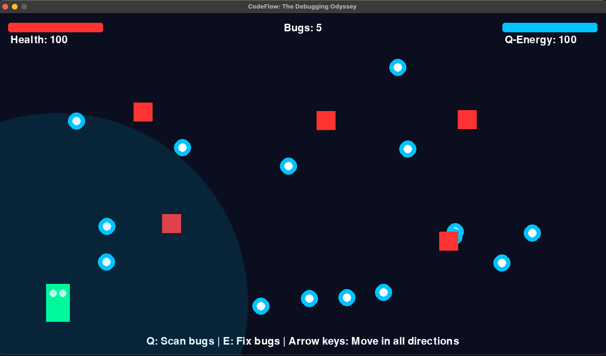

# CodeFlow: The Debugging Odyssey


A 2D puzzle-platformer game where you play as a "Code Cleaner" navigating through corrupted digital landscapes, using Amazon Q's debugging powers to fix broken code and optimize systems.

## Game Overview

CodeFlow is an engaging game designed for Gen Z audiences that transforms programming concepts into an exciting adventure. The game features:



- Cyberpunk-inspired visuals with neon colors and glitch effects
- Intuitive gameplay mechanics centered around debugging and code optimization
- Satisfying visual and audio feedback for every action
- Educational elements that introduce programming concepts in a fun way

## How to Play


1. **Movement**: Use arrow keys or WASD to move your character in all directions
2. **Q-Scan**: Press Q to scan for bugs in your vicinity
3. **Q-Fix**: Press E to fix highlighted bugs (costs Q-Energy)
4. **Collect Data Bytes**: Gather blue data bytes to replenish your Q-Energy

## Requirements

- Python 3.x
- Pygame

## Installation

### Option 1: Using the installation script (recommended)

1. Run the installation script: `./install_and_run.sh`
   - This will create a virtual environment
   - Install pygame in the virtual environment
   - Run the game

### Option 2: Manual installation

1. Make sure you have Python installed
2. Create a virtual environment: `python -m venv venv`
3. Activate the virtual environment:
   - On macOS/Linux: `source venv/bin/activate`
   - On Windows: `venv\Scripts\activate`
4. Install Pygame: `pip install pygame`
5. Run the game: `python main.py`

### Troubleshooting

If you encounter issues with the full game, try running the simplified version:

```
python simple_game.py
```

## Game Structure

- `main.py` - Main game entry point
- `settings.py` - Game constants and configuration
- `game_states.py` - Different game screens and states
- `game_objects.py` - Player, bugs, and other game objects
- `assets/` - Directory for game assets (sounds, images, etc.)

## Credits

Created based on the "CodeFlow: The Debugging Odyssey" game prompt.
