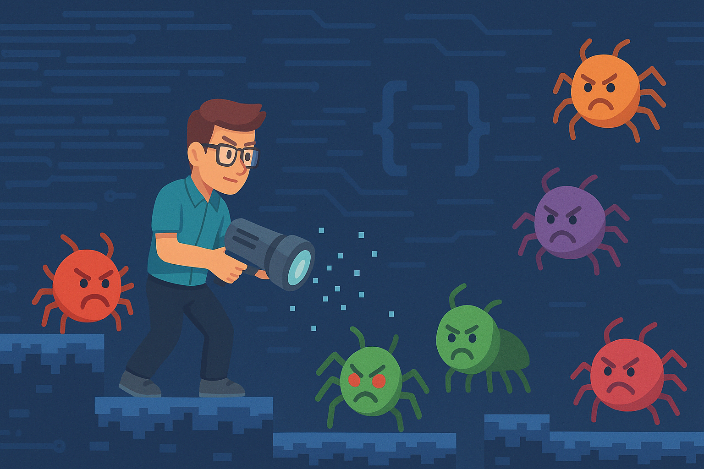
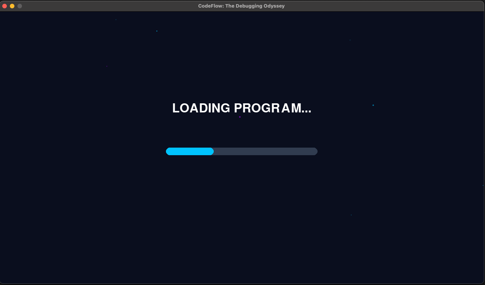

# CodeFlow: The Debugging Odyssey - A Pygame Adventure



## Introduction

Have you ever wanted to visualize what debugging code feels like? **CodeFlow: The Debugging Odyssey** transforms the abstract concept of debugging into an engaging 2D game experience. As a "Code Cleaner," you'll navigate through digital landscapes, scan for bugs, and fix them using your debugging powers.


This blog post will guide you through setting up and playing CodeFlow on your local machine. Whether you're a programming enthusiast, a game developer, or just someone looking for a fun way to understand debugging concepts, this game offers an entertaining experience with educational undertones.

## What is CodeFlow?

CodeFlow is a 2D game built with Python and Pygame that gamifies the debugging process. The core gameplay revolves around:

- Moving freely through a digital environment
- Scanning for bugs in your code
- Using your debugging powers (powered by Q-Energy) to fix these bugs
- Collecting Data Bytes to replenish your energy
- Completing levels by fixing all bugs before your health depletes

The game features a cyberpunk-inspired aesthetic with neon colors, particle effects, and a digital atmosphere that makes debugging feel like an adventure rather than a chore.

## Getting Started

### Prerequisites

Before you begin, make sure you have the following installed:

- **Python 3.x**: The programming language used to build the game
- **Git**: For cloning the repository

### Step 1: Clone the Repository

Open your terminal and run the following command to clone the CodeFlow repository:

```bash
git clone https://github.com/Shaistaaman/CodeFlow/
cd CodeFlow
```

### Step 2: Set Up the Environment

You have two options for setting up the game environment:

#### Option 1: Using the Installation Script (Recommended)

This is the easiest way to get started, especially if you're new to Python:

```bash
# Make the installation script executable
chmod +x install_and_run.sh

# Run the installation script
./install_and_run.sh
```

This script will:

1. Create a virtual environment
2. Install Pygame and other dependencies
3. Run the game

#### Option 2: Manual Setup

If you prefer to set things up manually:

```bash
# Create a virtual environment
python3 -m venv venv

# Activate the virtual environment
# On macOS/Linux:
source venv/bin/activate
# On Windows:
# venv\Scripts\activate

# Install dependencies
pip install -r requirements.txt

# Run the game
python3 main.py
```


### Step 3: Troubleshooting

If you encounter any issues with the full game, you can try running the simplified version:

```bash
python3 simple_game.py
```

This version has fewer features but is useful for testing if Pygame is working correctly on your system.

## How to Play

### Controls

- **Movement**: Use arrow keys or WASD to move your character in all directions
- **Q-Scan**: Press Q to scan for bugs in your vicinity (highlighted in purple)
- **Q-Fix**: Press E to fix highlighted bugs (costs Q-Energy)
- **Collect Data Bytes**: Move near blue orbs to collect them and replenish your Q-Energy

### Gameplay Tips

1. **Manage Your Resources**: Q-Energy is limited, so collect Data Bytes regularly and use your Q-Fix ability strategically.

2. **Scan Before Fixing**: Always use Q-Scan (Q key) before attempting to fix bugs. This highlights them and makes them safe to approach.

3. **Watch Your Health**: Unhighlighted bugs will damage your health if you touch them. Keep an eye on your health bar in the top-left corner.

4. **Use the Scan Range Indicator**: A faint blue circle shows your scan range. Position yourself to maximize the number of bugs you can scan at once.

5. **Move Strategically**: You can move in all directions, so use this freedom to navigate efficiently around the level.

## Game Screens

### 1. Splash Screen

The game starts with a splash screen showing the title "CodeFlow: The Debugging Odyssey." Press any key to continue.

### 2. Main Menu

From here, you can:

- Start a new debugging session
- Exit the game

  

Use the up/down arrow keys to navigate and Enter to select.

### 3. Loading Screen

A brief loading screen with a progress bar appears before each level.



### 4. Gameplay Screen

This is where the main action happens. You'll see:


- Your character (the Code Cleaner)
- Bugs that need fixing
- Data Bytes to collect
- HUD showing your health, Q-Energy, and remaining bugs

### 5. Level Complete Screen

When you fix all bugs, you'll see your stats:


- Time taken
- Bugs fixed
- Final score

### 6. Game Over Screen

If your health reaches zero, you'll see the "PROGRAM CRASHED!" screen. Press any key to return to the menu.

## Understanding the Code Structure

If you're interested in how the game works or want to modify it, here's a brief overview of the code structure:

- `main.py`: The entry point that initializes the game
- `settings.py`: Contains game constants and configuration
- `game_states.py`: Manages different game screens and states
- `game_objects.py`: Defines game objects like Player, Bug, DataByte, and Particle
- `assets/`: Directory for game assets (currently empty, ready for future expansion)

For a more detailed look at the architecture, check out the `architecture.md` file in the repository.

## Extending the Game

Want to add your own features? Here are some ideas:

1. **New Bug Types**: Create different kinds of bugs with unique behaviors
2. **Power-Ups**: Add special abilities or temporary boosts
3. **Multiple Levels**: Design different levels with increasing difficulty
4. **Sound Effects**: Add audio feedback for actions
5. **Visual Improvements**: Enhance the graphics with sprites and animations

## Educational Value

Beyond being fun, CodeFlow helps visualize important programming concepts:

- **Debugging**: The core gameplay mechanic of finding and fixing bugs
- **Resource Management**: Balancing energy usage with collection
- **Problem Solving**: Strategic planning to fix bugs efficiently
- **Code Health**: The consequences of letting bugs accumulate

## Conclusion

CodeFlow: The Debugging Odyssey transforms the often frustrating experience of debugging into an engaging game. By visualizing bugs as entities that can be scanned and fixed, it provides a fresh perspective on programming concepts while delivering an entertaining gameplay experience.

Whether you're using it as a fun break from actual coding or as an educational tool to introduce programming concepts, CodeFlow offers a unique blend of entertainment and learning.

Clone the repository, set up your environment, and start your debugging adventure today!

---

_This blog post is about a fictional game created for demonstration purposes. The GitHub repository mentioned is hypothetical._
